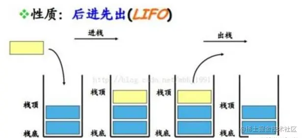
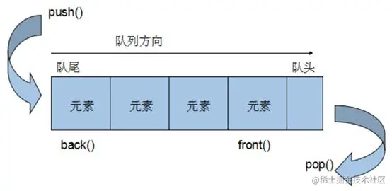

事件循环，面试高频考点

要弄清楚事件循环，先弄懂栈的概念：

### 栈（Stack）

用通俗的语言来说栈就是一种数据结构，按照**后进先出**的原则。




### 队列（Queue）


队列和栈的概念刚好相反，  **队列**的数据元素又称为 **队列元素** 。在队列中插入一个队列元素称为 **入队** ，从**队列**中**删除**一个队列元素称为 **出队** 。因为队列**只允许**在一端 **插入** ，在另一端 **删除** ，所以只有**最早**进入**队列**的元素**才能最先从队列中**删除，故队列又称为 **先进先出** （`FIFO—first in first out`）



好了，接下来说回事件循环，事件循环也叫event Loop

在 `JavaScript`中，任务被分为两种，一种宏任务（`MacroTask`）也叫 `Task`，一种叫微任务（`MicroTask`）。


### MacroTask（宏任务）

* `script`全部代码、`setTimeout`、`setInterval`、`setImmediate`（浏览器暂时不支持，只有IE10支持，具体可见[`MDN`](https://link.juejin.cn/?target=https%3A%2F%2Fdeveloper.mozilla.org%2Fzh-CN%2Fdocs%2FWeb%2FAPI%2FWindow%2FsetImmediate "https://developer.mozilla.org/zh-CN/docs/Web/API/Window/setImmediate")）、`I/O`、`UI Rendering`。

### MicroTask（微任务）

* `Process.nextTick（Node独有）`、`Promise`、`Object.observe(废弃)`、`MutationObserver`

`Javascript` 有一个 `main thread` 主线程和 `call-stack` 调用栈(执行栈)，所有的任务都会被放到调用栈等待主线程执行。

### JS调用栈

JS调用栈采用的是后进先出的规则，当函数执行的时候，会被添加到栈的顶部，当执行栈执行完成后，就会从栈顶移出，直到栈内被清空。


在JavaScript中，宏任务和微任务的执行顺序是不同的，微任务会在宏任务执行完成后立即执行。具体的说，以下是它们执行的顺序：

1. 当主线程执行完一个宏任务后，会检查该宏任务中是否有微任务，如果有则立即执行所有微任务，直到微任务队列为空。
2. 当执行完所有的微任务之后，主线程会从宏任务队列中检索并执行下一个宏任务。
3. 如果在当前执行宏任务的过程中产生了新的微任务，则将这些微任务添加到微任务队列的末尾。在宏任务执行完成后，将立即执行这些微任务。
4. 微任务可以嵌套其他微任务，直到队列为空为止。如果有多个微任务，则它们按照添加到队列中的顺序依次执行。

因此，微任务总是在同一次事件循环中执行，而宏任务的执行周期取决于它们被添加到队列中的时间。

例子：

```javascript
console.log('start')

setTimeout( function () {
console.log('setTimeout')
}, 0 )

Promise.resolve().then(function() {
console.log('promise1');
}).then(function() {
console.log('promise2');
});
```


浏览器中，上述代码的打印结果为：

```
start
end
promise1
promise2
setTimeout
```

解释：

1. 首先，主程序线程同步执行 `console.log('start')`和 `console.log('end')`，将其先输出。
2. 然后，`setTimeout()`方法被添加到任务队列的末尾，等待主程序线程执行完成并返回控制权。
3. 接着，Promise对象被创建并添加到微任务队列中，由于无延迟要求，因此立即执行。因此，`console.log('promise1')`会被输出。紧接着，第二个微任务 `then`被添加到微任务队列中，并在当前微任务执行完成之后执行。
4. 因此，`console.log('promise2')`被输出。
5. 接下来，执行完所有的微任务之后，主程序线程从宏任务队列中检索并执行下一个宏任务，即 `setTimeout()`方法。由于 `setTimeout()`的延迟被设置为零，因此它会立即被执行，输出 `console.log('setTimeout')`。

因此，上述代码的输出顺序为 `start`、`end`、`promise1`、`promise2`、`setTimeout`。
